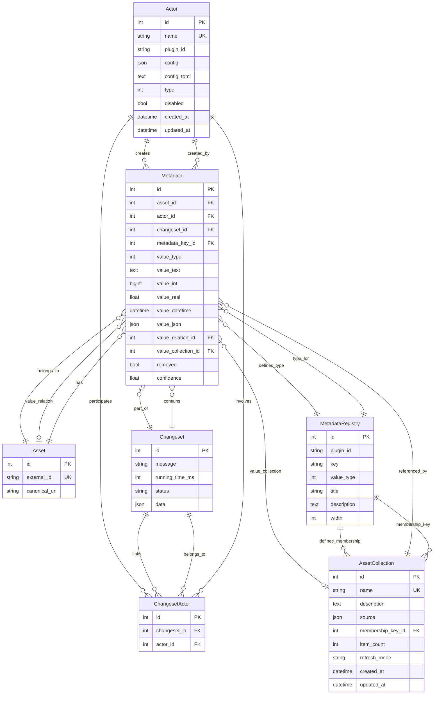

# Database Schema Diagram

## Entity Relationship Diagram



## Key Relationships

- **Actor**: Represents plugins (sources, processors, analyzers, editors, exporters) that interact with assets
- **Asset**: Core entity representing a file or resource
- **Metadata**: Flexible key-value store for asset properties, versioned by changeset
- **Changeset**: Tracks changes made during operations (scans, edits)
- **MetadataRegistry**: Defines available metadata keys and their types
- **AssetCollection**: Groups of assets with shared properties
- **ChangesetActor**: Many-to-many relationship between changesets and actors

## Special Features

- Metadata uses polymorphic value columns (value_text, value_int, value_real, etc.)
- Metadata can reference other Assets (value_relation) or Collections (value_collection)
- All metadata changes are versioned through changesets for audit trail
- Soft-delete pattern via `removed` flag on Metadata
- Confidence scores on metadata for ML/AI-generated values

---

## Instructions for LLM to Regenerate This Diagram

To regenerate this database schema diagram:

1. Read all Python files in `src/katalog/models/` directory
2. Identify all classes that inherit from `tortoise.models.Model`
3. For each model class:
   - Extract the table name (class name)
   - List all field definitions using Tortoise ORM field types
   - Identify primary keys (PK), foreign keys (FK), unique constraints (UK)
   - Note relationships: ForeignKeyField, on_delete behavior
4. Create a Mermaid ERD using this format:
   ```
   EntityName {
       type field_name constraints
   }
   ```
5. Define relationships using Mermaid syntax:
   - `||--o{` for one-to-many
   - `}o--||` for many-to-one
   - `}o--o{` for many-to-many
   - `}o--o|` for optional relationships
6. Add a relationships section explaining the purpose of each entity
7. Note any special patterns (polymorphic columns, soft deletes, versioning)

Key files to analyze:
- `models/core.py`: Actor, Changeset, ChangesetActor
- `models/assets.py`: Asset, AssetCollection
- `models/metadata.py`: Metadata, MetadataRegistry
- `models/views.py`: View/display models (non-database)
